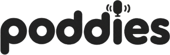
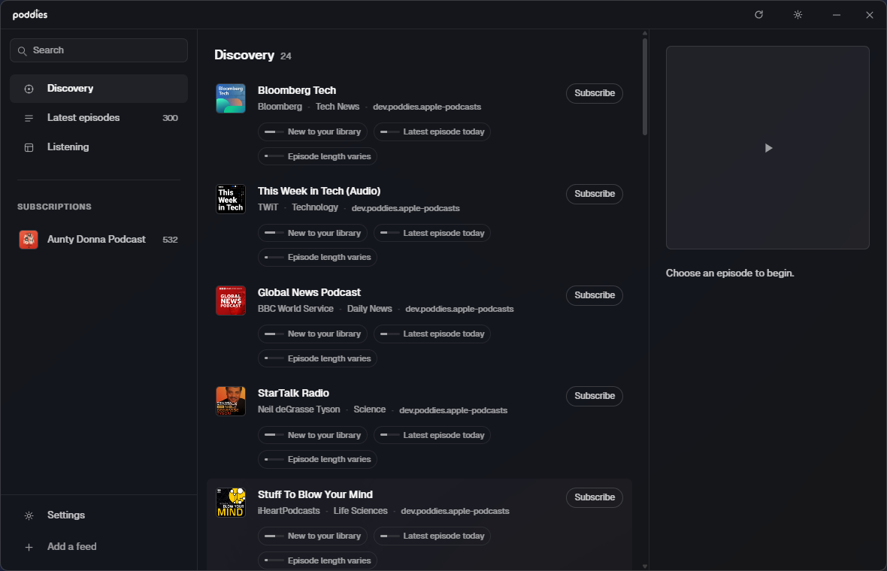
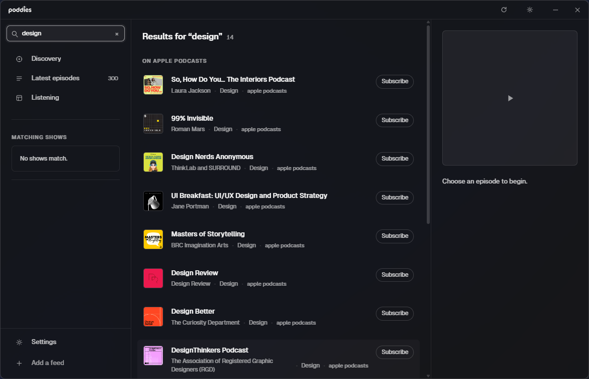

<p align="center">
  <picture>
    <source media="(prefers-color-scheme: dark)" srcset="docs/logo-light.png">
    
  </picture>
</p>

<h3 align="center">An ultra-minimal podcast client for Windows</h3>

<p align="center">
  A lean Rust host. A first-class, sandboxed plugin system.<br>
  No accounts, no telemetry, no AI filler, and no black-box recommendations.
</p>

<p align="center">
  <a href="#quick-start"></a>
  <a href="https://www.rust-lang.org"></a>
  <a href="https://v2.tauri.app"></a>
  
  
</p>

<p align="center">
  
</p>

---

Three panes: **library**, **episode list**, **now playing**. Mica behind everything,
generous whitespace, Geist, one accent colour — **none**. Album art is the only
pigment on screen, so a quiet interface stays quiet even when a thousand episodes
are in it. Closing or minimising sends it to the system tray; restoring plays a
soft **bloom** opening animation.

- **Subscriptions** — RSS 2.0, Atom, RSS 1.0 and JSON Feed all parse, with
  conditional refreshes (`If-None-Match` / `If-Modified-Since`) so checking for
  new episodes costs nothing when nothing changed. Add a feed from the dialog in
  the sidebar, and drop one from the same row on hover.
- **Search** — your whole library, plus [Apple Podcasts](https://itunes.apple.com/search)
  over its public, unauthenticated endpoint, so a query finds shows you have not
  subscribed to yet. Add one in a click.

  <p align="left">
    
  </p>

- **Discovery that shows its work.** Candidate shows come from plugins; ranking
  happens in the host as an explicit sum of named factors whose weights you can
  drag. Every suggestion carries the reasons that moved it, inline.
- **A plugin system that is genuinely easy** — scaffold, hot-reload, ship.
- **Featherweight** — 8.9 MB exe, ~26 KB of JavaScript, no font downloads,
  zero framework.

## Quickstart

```powershell
# the UI must be compiled first: Tauri embeds it into the exe
cd app ; pnpm install ; pnpm build ; cd ..

# the deliverable
cargo build --release -p poddies
```

```
target\release\poddies.exe      # 8.9 MB, single portable executable
```

Development uses the Vite dev server instead of the embedded bundle — disable the
production feature for a live-reload loop:

```powershell
cd app ; pnpm dev                               # terminal 1
cargo run -p poddies --no-default-features       # terminal 2
```

**Requirements:** Windows 11 (Mica; Windows 10 works without it), WebView2
(bundled with Windows 11), Rust stable with the MSVC toolchain, Node 20+ with
pnpm. Python 3 on `PATH` only if you want to run Python plugins.

## Plugins

Plugins never run inside the app. The host spawns a worker — *its own binary,
re-invoked* as `poddies.exe --plugin-worker <dir>` — and talks to it over
newline-delimited JSON on stdio. A native plugin is a `cdylib` the worker loads
through a stable C ABI; a Python plugin is a script it runs. Either way the
plugin lives in its own process, so a panic, hang or hard crash takes down the
worker and nothing else, and the host restarts it.

```powershell
poddies-cli new plugin my-panel --lang rust       # scaffold
poddies-cli dev .\plugins\my-panel                # build · load · reload on save
poddies-cli check .\plugins\my-panel              # validate
poddies-cli docs                                  # API reference in the terminal
```

A plugin's whole surface is one trait — `describe`, `on_request`, optional hooks —
and the host renders everything it returns with the app's own typography:

```rust
impl Plugin for MyStats {
    fn info(&self) -> PluginInfo { /* id, name, ui_panels */ }

    fn on_request(&mut self, method: &str, _params: Value) -> Result<Value, PluginError> {
        match method {
            "ui/panel" => Ok(json!({
                "panel_id": "main",
                "widgets": [{ "type": "heading", "text": "Hello" }]
            })),
            other => Err(PluginError::unsupported(other)),
        }
    }
}

export_plugin!(MyStats);
```

Two reference plugins ship in [`plugins/`](plugins) and cover the whole
lifecycle, each built as a real `.dll`:

| Plugin | Capability | Demonstrates |
|---|---|---|
| **Listening Stats** | `ui-panel`, `library-read` | host calls, aggregating history, declarative widgets |
| **Apple Podcasts** | `discovery-source` | feeding the Discovery queue from the public Apple Podcasts API (no key), caching, offline fallback |

| | |
|---|---|
| API reference | [`docs/plugin-api.md`](docs/plugin-api.md) |
| Authoring guide | [docs/plugin-authoring.md](docs/plugin-authoring.md) |
| Architecture | [docs/architecture.md](docs/architecture.md) |

## Discovery, without a black box

```
score = Σ (weight × factor) − explicit_penalty − diversity_penalty
```

Candidates come from plugins. Ranking belongs to the host, as a linear
combination of **topic match**, **your follow-through**, **newness**, **novelty**,
**length fit**, an **explicit filter** and **variety** — the sliders in Settings.
Every recommendation carries the contributions that produced it as reason chips,
and `popularity` from a source is only ever a tie-breaker, so nothing can quietly
outweigh your own listening. The full maths is in
[architecture.md](docs/architecture.md#the-discovery-algorithm).

## Design

A near-monochrome world. State, rank and selection are carried by tone, weight
and space; the only saturated colour is podcast artwork. Geist is bundled with
the binary, so the interface is identical everywhere and costs no network request.
The titlebar is the only chrome: drag it, double-click it to maximise, and the
wordmark is inverted for dark mode so the work reads as one piece on any
wallpaper. All motion uses one easing curve and honours `prefers-reduced-motion`.

## Repository

```
crates/poddies-core/         feeds, library, discovery ranking — no UI, no platform
crates/poddies-plugin-api/   the versioned contract: protocol, widgets, C ABI
crates/poddies-plugin-sdk/   Rust authoring surface
crates/poddies-plugin-host/  the sandboxed worker and its manager
crates/poddies-cli/          scaffolding, dev loop, validation
app/                         the Tauri host and the interface
python/poddies/              the Python plugin SDK
docs/                        authoring guide, API reference, architecture
```

```powershell
cargo test --workspace      # 43 tests across five crates
cargo clippy --workspace --all-targets
```

## Licence

[MIT](LICENSE).
